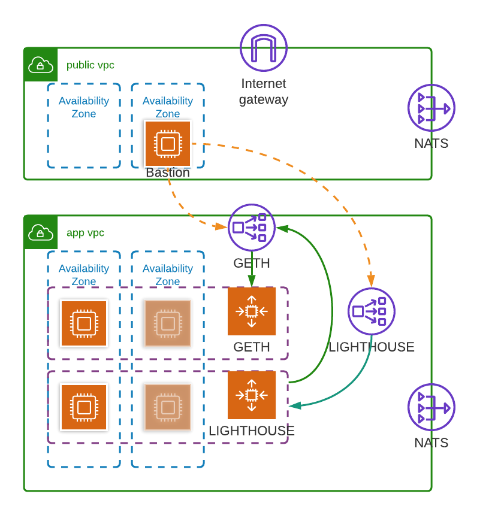

# ethereum-beacon-chain-aws
Code to operate ethereum beacon chain on AWS.  

This deployment is based on [this](https://someresat.medium.com/guide-to-staking-on-ethereum-2-0-ubuntu-pyrmont-lighthouse-a634d3b87393) guide for deploying to the Pyrmont testnet.

## Architecture



## Deployments
### Requirements
1. You've bootstrapped your target environment using `cdk bootstrap`
2. You've built the AMI using [aws-imagepipelines](https://github.com/juliosantos84/aws-imagepipelines).

### Deploying
```bash
bin/deploy-stacks.sh
```

To deploy individual stacks:
```bash
cdk deploy ethereumBeaconChainService/development [--require-approval never]
```

After deploying, scale up the ASGs.  You can run 
```bash
export ASG_NAME=<your asg name> 
export ASG_DESIRED_CAPACITY=1 
bin/set-desired-capacity.sh
```
## Todo

[X] - Create VPC network

[X] - Create ETH Instance

[X] - Join goeth to goerli testnet

[X] - Join lighthouse to pyrmont testnet

[ ] - Add monitoring

[ ] - Automate validator wallet import
```bash
sudo lighthouse --network pyrmont account validator import --keystore /home/ubuntu/validator_keys/keystore.json --datadir /var/lib/lighthouse
```
[ ] - Externalize instance-specific settings (VPC CIDRs, Domain names, etc)

## Project layout

The `cdk.json` file tells the CDK Toolkit how to execute your app.

It is a [Maven](https://maven.apache.org/) based project, so you can open this project with any Maven compatible Java IDE to build and run tests.

## Useful commands

 * `mvn package`     compile and run tests
 * `cdk ls`          list all stacks in the app
 * `cdk synth`       emits the synthesized CloudFormation template
 * `cdk deploy`      deploy this stack to your default AWS account/region
 * `cdk diff`        compare deployed stack with current state
 * `cdk docs`        open CDK documentation